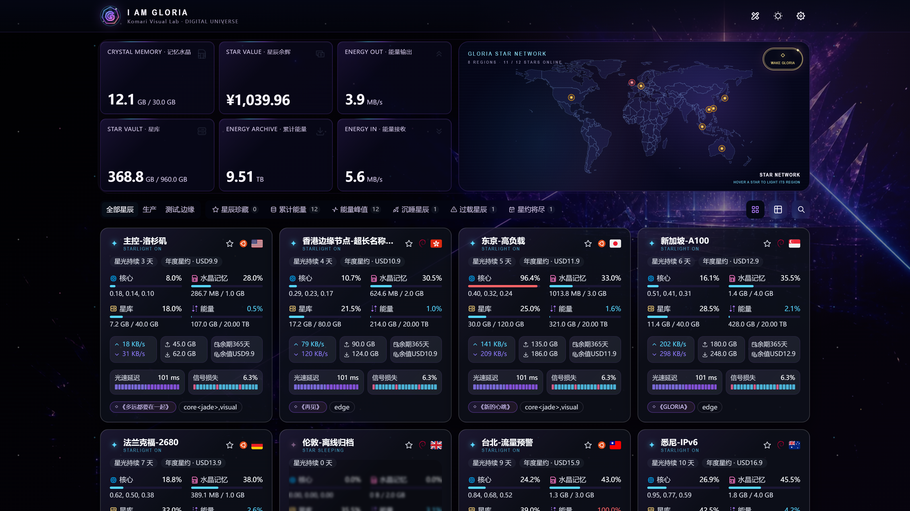

# GLORIA UNIVERSE

Komari × G.E.M. 邓紫棋粉丝向监控主题。

[](https://github.com/TonyStarkJr2021/komari-theme-Gloria-Universe/releases/latest)
[](https://github.com/TonyStarkJr2021/komari-theme-Gloria-Universe/actions/workflows/quality.yml)
[](LICENSE)

[下载最新安装包](https://github.com/TonyStarkJr2021/komari-theme-Gloria-Universe/releases/latest) · [安装说明](#安装) · [主题设置](#推荐设置) · [本地开发](#本地开发)

> 将 VPS 节点变成星辰，将实时流量变成舞台能量流，将 Komari 首页变成 I AM GLORIA 数字宇宙控制中心。



## 主题信息

- 当前版本：`1.5.4`
- 基础工程：Komari Glassmorphism v3（MIT）
- 技术栈：Vue 3、Vite、Tailwind CSS v4、Pinia
- 兼容范围：沿用基础工程的 Komari 1.2.x Metric Store 与旧接口 fallback
- 默认模式：深空模式

## v1.5.4 更新

- Komari 左侧栏入口精简为“主题设置”，避免窄侧栏文字换行。
- 桌面端重新平衡实时网速、累计流量与星约信息三栏宽度。
- 节点卡片将“星约余期 / 星约余值”精简为“余期 / 余值”，避免金额和流量截断。
- 移动端页脚署名固定单行显示，保持 `Powered by Komari Monitor` 与 `Theme by TonyStarkJr2021` 清晰完整。
- 新增桌面端卡片防截断和移动端页脚单行回归检查。

## 视觉实现

- 原创 `Crystal G` 品牌标志
- 原创舞台深空背景，使用紫、蓝、粉、香槟金宝石折射色
- `GLORIA STAR NETWORK` 星网地图与 I AM GLORIA 2.0 婚纱舞台彩蛋原图
- 世界地图按国家或地区聚合节点：存在在线节点时显示橙金呼吸点，全部离线时切换为红色呼吸点，并支持地区板块悬停高亮与键盘操作
- `STARLIGHT ON`、`STAR SLEEPING`、`CORE POWER`、`ENERGY FLOW` 状态语言
- CPU、内存、磁盘、流量分别映射为核心、水晶记忆、星库与能量
- 节点歌曲标签优先不重复分配，支持管理员配置授权的 20–30 秒悬停试听片段
- `WAKE GLORIA` 婚纱舞台彩蛋与“如果神让你看见”主题文案
- 桌面端与手机端响应式布局，以及 `prefers-reduced-motion` 低动态适配

## 版权与素材边界

主题以粉丝文化和演唱会舞台语言为灵感。首页使用本地世界地图数据绘制可交互的 GLORIA 星网地图，不展示人物照片；WAKE GLORIA 彩蛋背景采用新闻媒体公开发布的 I AM GLORIA 2.0 婚纱舞台照片。主题不内置音乐；歌曲片段试听只读取管理员自行配置并有权使用的音频。

如果自行配置人物照片或视频，请确保拥有对应素材的使用权。

## 安装

1. 登录 Komari 后台。
2. 进入“设置 → 主题管理”。
3. 上传对应版本的 `GLORIA-UNIVERSE-Komari-Theme-v*.zip`。
4. 启用 `Gloria Universe`。
5. 在“主题设置”中调整背景、卡片、歌曲标签、试听和动画。

请上传构建生成的主题 ZIP，不要上传源码 ZIP。

## 推荐设置

```text
默认宇宙模式：dark
节点卡片尺寸：compact
宝石玻璃配色：午夜
显示粉丝歌曲标签：开启
停止核心旋转：关闭
宇宙总览方案：自定义
```

默认总览卡片顺序：

```text
memory
remainingValue
uploadSpeed
disk
totalTraffic
downloadSpeed
```

## 本地开发

要求 Node.js `^20.19.0` 或 `>=22.12.0`，推荐 Bun `>=1.2.0`。

```bash
bun install
bun run dev
bun run lint
bun run build
```

构建产物固定包含：

```text
komari-theme.json
preview.png
dist/
```

## 主要目录

```text
public/images/gloria/
├── crystal-g.svg
└── gloria-core.webp

src/components/
├── GloriaCore.vue
├── Header.vue
├── NodeGeneralCards.vue
└── NodeCard.vue
```

## 致谢与许可

- 基础主题：[komari-theme-Glassmorphism](https://github.com/sanrokamlan-prog/komari-theme-Glassmorphism)
- 监控系统：[Komari](https://github.com/komari-monitor/komari)
- 本项目继承基础工程的 MIT License。
